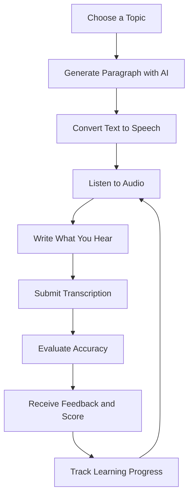

# English By Ear 🔠

**English By Ear** is an AI-powered English learning application designed to improve listening comprehension, spelling, writing, and vocabulary through interactive dictation exercises.

By combining AI-generated content, Text-to-Speech (TTS), and automated accuracy evaluation, English By Ear provides an engaging and personalized learning experience for English learners of different proficiency levels.

## ✨ Features

### 📝 1. Topic Selection

Choose a topic or title based on your interests, learning goals, or preferred subject. Topics range from everyday conversations to specialized subjects, helping learners explore different contexts and vocabulary.

### 🤖 2. AI-Generated Content

Generate original, coherent, and contextually relevant paragraphs based on the selected topic. Each paragraph serves as the foundation for an interactive listening and transcription exercise.

### 🔊 3. Text-to-Speech (TTS)

Convert generated paragraphs into audio using Text-to-Speech technology.

* Listen to natural-sounding speech.
* Replay audio as many times as needed.
* Improve pronunciation awareness and listening comprehension.

### ✍️ 4. Interactive Dictation

Listen carefully and type exactly what you hear.

This exercise helps learners develop:

* Active listening skills
* Spelling accuracy
* Grammar awareness
* Sentence structure recognition
* Attention to pronunciation and connected speech

### 📊 5. Accuracy Evaluation

After submitting a transcription, the application compares the learner's answer with the original text and provides detailed feedback.

Evaluation includes:

* **Correct Words:** Words transcribed accurately.
* **Mistakes:** Incorrect, missing, or mismatched words.
* **Suggestions:** Corrections and recommendations for improvement.
* **Overall Score:** A percentage-based accuracy score to measure performance.

### 📈 6. Progress Tracking

Track performance over time and gain insights into learning progress.

Progress tracking helps learners:

* Monitor improvement.
* Identify recurring mistakes.
* Recognize strengths and weaknesses.
* Stay motivated through measurable results.

## 🎯 Benefits

| Benefit               | Description                                                               |
| --------------------- | ------------------------------------------------------------------------- |
| Enhanced Listening    | Develop the ability to understand spoken English, rhythm, and intonation. |
| Better Spelling       | Reinforce correct spelling through active transcription.                  |
| Grammar Improvement   | Become more familiar with sentence structures and grammatical patterns.   |
| Vocabulary Expansion  | Learn words and expressions through contextual exposure.                  |
| Increased Confidence  | Build confidence through interactive practice and measurable progress.    |
| Personalized Learning | Practice with topics and feedback suited to individual learning needs.    |

## 🔄 How It Works



## 🛠️ Technologies

English By Ear integrates modern web technologies and AI-powered services to deliver an interactive learning experience.

* **Frontend:** Next.js, React, TypeScript
* **Styling:** Tailwind CSS
* **Backend & Authentication:** Supabase
* **AI:** AI-powered text generation and evaluation
* **Audio:** Text-to-Speech (TTS)

## 🚀 Getting Started

### Prerequisites

Make sure you have the following installed:

* Node.js
* pnpm
* Git

### Installation

Clone the repository:

```bash
git clone https://github.com/YOUR_USERNAME/english-by-ear.git
```

Navigate to the project directory:

```bash
cd english-by-ear
```

Install dependencies:

```bash
pnpm install
```

Create a `.env.local` file in the root directory and configure the required environment variables:

```env
NEXT_PUBLIC_SUPABASE_URL=your_supabase_url
NEXT_PUBLIC_SUPABASE_ANON_KEY=your_supabase_anon_key
```

Start the development server:

```bash
pnpm dev
```

Open http://localhost:3000 in your browser.

## 🌐 Live Demo

[English By Ear](https://englishbyear.com)

## 🎓 Target Audience

English By Ear is designed for:

* Beginner to advanced English learners.
* Students preparing for English proficiency exams.
* Learners who want to improve listening and writing skills.
* Anyone interested in practicing English through interactive AI-powered exercises.

## 🔮 Future Improvements

* [ ] Multiple English accent options.
* [ ] Adjustable audio playback speed.
* [ ] CEFR-based learning levels (A1–C2).
* [ ] Advanced vocabulary and grammar analysis.
* [ ] Personalized AI learning recommendations.
* [ ] Expanded learning statistics and performance analytics.
* [ ] Speaking and pronunciation practice.

## 📄 License

This project is developed for educational purposes.

---

**Learn English, one sound at a time. 🎧**

Made with ❤️ by English By Ear.
